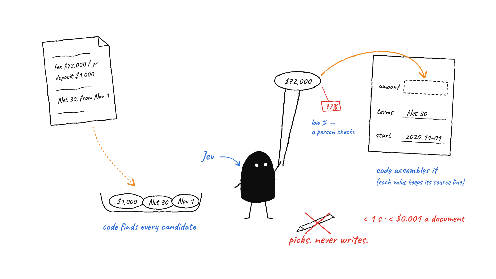
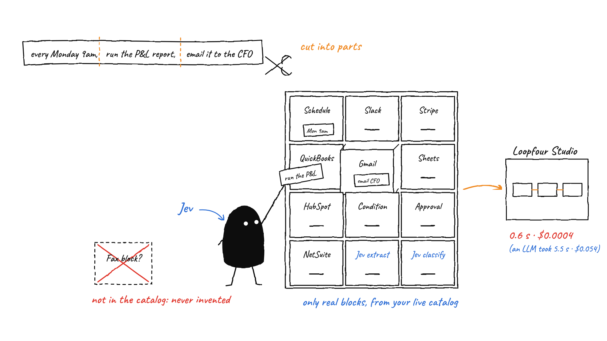

# l4-jev-workflows

**Loopfour Studio features rebuilt with [Jev](https://docs.typesafe.ai) (TypeSafe's System One model) instead of an LLM.**

[Live site](https://l4-jev-workflow-builder.vercel.app) · [Jev docs](https://docs.typesafe.ai) · [Loopfour Studio](https://studio.loopfour.ai) · [Technical README](workflow-builder/README.md)

## How it works

Code finds the candidate answers, Jev picks the right one with a calibrated confidence, and code
assembles the result. Jev never writes text, so a total, a date or a block name cannot be invented.

- **Code finds candidates:** every amount, date, term or label the document could mean.
- **Jev picks:** one typed answer per question, with a probability. Low confidence goes to a person.
- **Code assembles:** each value is copied verbatim into the result and keeps its source line for the audit trail.

## What's inside

| Function | What it does | Endpoint |
|---|---|---|
| **Workflow builder** | Plain-language description → Loopfour Studio workflow, created through the Loopfour Workflows API | `POST /api/plan`, `POST /api/create` |
| **Extraction** | Document + JSON Schema (or a field list) → JSON, every value copied from the document | `POST /api/extract` |
| **Classification** | Document + labels → label(s) with probabilities and a review flag | `POST /api/classify` |
| **Jev vs LLM race** | The same input sent to Jev and to claude-opus-5 at the same moment, both timed live in the browser | `POST /api/race` (LLM side) |

Extraction and classification plug into any Studio workflow through an **API Request** block. An
optional cascade sends only the answers Jev is unsure about to an LLM, and keeps an answer only if it
quotes the document and Jev confirms it.

## The workflow builder

The workflow builder works the same way: the description is cut into parts, and Jev files each part under a
block from your workspace's live Loopfour catalog, so a block that does not exist is never used.
Descriptions of Loopfour's own templates are recognized and recreated step for step.

## Workflows that use Jev extraction and classification

Describe a step that extracts fields or sorts a document into labels, and the builder adds a **Jev Extraction**
or **Jev Classification** step (an API Request block calling `/api/extract` or `/api/classify`), with no AI
Agent and no LLM at run time. Each of these prompts was checked against the live builder:

| Prompt | Workflow the builder creates |
|---|---|
| *When a signed contract arrives, extract the customer name, annual fee, start date, billing frequency and payment terms, then create a customer in Stripe and notify #billing in Slack.* | **Jev Extraction** → Stripe: Create Customer → Slack: Send Message |
| *Extract the invoice number, vendor, total and due date from the invoice, then create a bill in QuickBooks.* | **Jev Extraction** → QuickBooks: Create Bill |
| *Extract the vendor, amount and expense category from the receipt. If the amount is over $5,000, ask cfo@acme.com for approval, then create a bill in QuickBooks.* | **Jev Extraction** → Condition → Approval → QuickBooks: Create Bill |
| *Extract the payer, amount and invoice reference from the remittance email, then notify #cash-app in Slack with the result.* | **Jev Extraction** → Slack: Send Message |
| *Classify the support ticket as billing, technical or sales, then post it to #support in Slack.* | **Jev Classification** → Slack: Send Message |
| *Classify the customer's collections reply as promise to pay, dispute, payment sent or out of office, then notify #collections in Slack.* | **Jev Classification** → Slack: Send Message |
| *Search Gmail for new emails every hour, classify them as invoice, receipt or other and add the results to a Google Sheet.* | Schedule → Gmail: Search Emails → **Jev Classification** → Google Sheets: Append Values |
| *Classify each vendor invoice as software, travel, marketing or office supplies and add a row to the Google Sheet.* | **Jev Classification** → Google Sheets: Append Values |

## Measured

Same inputs on both sides, scored the same way; the LLM is claude-opus-5 run as a Loopfour agent, with the cost Loopfour reports.

| Task | Jev | LLM (claude-opus-5) | Jev is |
|---|---|---|---|
| Build a workflow from a description (5 descriptions) | **0.64 s · $0.00042**, 5/5 correct | 5.52 s · $0.054, 5/5 correct | 8.6× faster, 128× cheaper |
| Extract 11 billing fields (incl. line items) from an order form, 3 runs | **0.47 s · $0.00049**, 11/11 correct | 5.00 s · $0.0154, 11/11 correct | 10.6× faster, 32× cheaper |
| Classify support tickets (4 tickets × 2 runs) | **0.20 s · $0.000025**, 8/8 correct | 2.85 s · $0.0041, 8/8 correct | 14.4× faster, 163× cheaper |

## Try it

Open the [live site](https://l4-jev-workflow-builder.vercel.app) and enter your own Loopfour and Jev
keys; the site stores none. To run it locally, see [`workflow-builder`](workflow-builder/README.md).

| Folder | What it is |
|---|---|
| [`workflow-builder`](workflow-builder) | The Next.js site and API: builder, extraction, classification, tests |
| [`assets`](assets) | README illustrations |
